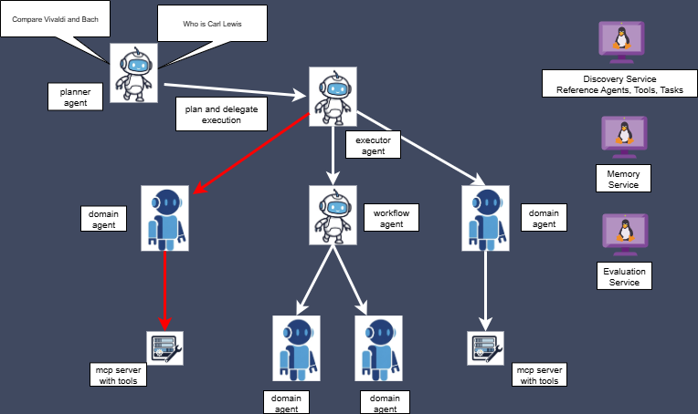

# 🚀 Swarm: A Framework for Building and Orchestrating Intelligent Agents in Rust 🦀

> **Swarm** is a Rust framework for creating and managing a network of specialized, intelligent agents that collaborate through flexible workflows. It acts as a central nervous system for your digital workforce, allowing you to orchestrate complex tasks, either by executing predefined plans or by generating them dynamically.

<p align="center" width="60%">
    
</p>

## **Why Swarm?**

Building multi-agent systems is complex. You need to manage communication, sequence tasks, and integrate external tools. Swarm simplifies this by providing the backbone for agents to collaborate seamlessly, allowing you to focus on building intelligent solutions, not on the plumbing.

---

## **How It Works**


Swarm's architecture is designed around a collaborative "conductor" and "specialist" model, facilitating efficient execution of complex tasks:

1.  **User Request & Planning (Planner Agent - The Conductor, Part 1):**
    *   A user initiates a request, which is received by the **Planner Agent**.
    *   The Planner Agent, acting as the primary orchestrator, determines the optimal course of action. It can:
        *   Load a predefined plan ("static workflow") from a JSON file.
        *   Dynamically generate a new plan ("dynamic workflow") by evaluating the capabilities of available **Domain Agents**.
    *   Once a plan is established, it is passed to the **Executor Agent**.

2.  **Execution & Evaluation (Executor Agent - The Doer; Planner Agent - The Conductor, Part 2):**
    *   The **Executor Agent** receives the plan from the Planner Agent and meticulously executes each step. This involves coordinating with **Domain Agents** and utilizing various tools through the **MCP Runtime**. The Executor Agent reports the outcome of the execution back to the Planner Agent.
    *   For **dynamic plans**, the **Planner Agent** then takes this outcome and, using an integrated **LLM-as-a-Judge** system via the **Evaluation Service**, critically assesses the execution's success. If the evaluation score is unsatisfactory, the Planner Agent can leverage this feedback to refine the plan, potentially regenerating and re-executing an improved workflow. This creates a powerful feedback loop for continuous improvement in dynamic scenarios.

3.  **Specialized Task Handling (Domain Agents - The Specialists):**
    *   **Domain Agents** are the core "workers," each specializing in a particular domain (e.g., customer care, weather forecasting, data analysis).
    *   Each Domain Agent is powered by its own Large Language Model (LLM) and equipped with a dedicated set of tools to accomplish its specific tasks, responding to directives from the Executor Agent.

This modular and iterative structure enables the creation of sophisticated multi-agent systems where a central orchestrator efficiently delegates, executes, and refines tasks through a team of specialized, intelligent agents.

---

## **🚀 Quickstart: Launch Your First Swarm in 5 Minutes**

### Prerequisites

1.  **Install Rust**: If you don't have it already, download and install it from [rust-lang.org](https://www.rust-lang.org/tools/install).
2.  **Get an LLM API Key**: Swarm agents require an LLM to function. We recommend obtaining a free API key from [Groq](https://console.groq.com/keys) or [Google AI Studio (for Gemini)](https://aistudio.google.com/app/apikey).

### Step 1: Clone and Build the Project

```bash
git clone https://github.com/fcn06/swarm.git # Replace with your actual repository URL
cd swarm
cargo build --release
```

### Step 2: Set Your LLM API Keys

The quickstart demo utilizes LLMs for various agent roles. For simplicity, you can use the *same* API key for all roles, especially when starting with Groq.

```bash
# Replace <YOUR-LLM-API-KEY> with your actual API key. 
# For the pre configured demo below, we use groq provider. ( https://groq.com/)
export LLM_A2A_API_KEY=<YOUR-LLM-API-KEY>       # For general Agent-to-Agent communication
export LLM_MCP_API_KEY=<YOUR-LLM-API-KEY>       # For Model Context Protocol interactions
export LLM_JUDGE_API_KEY=<YOUR-LLM-API-KEY>     # For the LLM-as-a-Judge evaluation service
export LLM_PLANNER_API_KEY=<YOUR-LLM-API-KEY>     # For the Planner Agent
export LLM_EXECUTOR_API_KEY=<YOUR-LLM-API-KEY>     # For the Executor Agent 
```

### Step 3: Run the Demo

Our primary demo showcases Swarm's workflow management capabilities, integrating direct tool calls and delegated actions to specialized agents. You can run it in three modes:

*   **Dynamic Workflow Generation:** This mode dynamically generates an execution plan based on your query and the skills of available agents. It highlights Swarm's adaptive planning capabilities.
    ```bash
    # This command must be run from the root of the swarm project
    sh ./documentation/demo_planner_executor_management/run_all_commands.sh --dynamic-generation
    ```

*   **Static Workflow (Default):** This executes a predefined workflow loaded from a JSON file. Ideal for predictable and repeatable processes.
    ```bash
    # This command must be run from the root of the swarm project
    sh ./documentation/demo_planner_executor_management/run_all_commands.sh
    ```

*   **High-Level Plan Generation:** This option only generates a high-level plan without executing it. It's useful for evaluating the planning logic of your LLM.
    ```bash
    # This command must be run from the root of the swarm project
    sh ./documentation/demo_planner_executor_management/run_all_commands.sh --high-level-plan
    ```

**Important: Stopping the Demo Services**
After running any of the above demos, it's crucial to stop all active agent processes to prevent resource consumption and conflicts.

```bash
# This command must be run from the root of the swarm project
sh ./documentation/demo_planner_executor_management/terminate_all_agents_process.sh
```

---

**Congratulations, you've just run your first swarm!**

---


## **💡 Other Examples**

You can interact with your agent system through a UI , and will find examples in [./documentation/Sample_Scenarios/scenario_ui.txt](./documentation/Sample_Scenarios/scenario_ui.txt)

<p align="center" width="60%">
    
</p>

You can find other real world scenarios in [./documentation/Sample_Scenarios/scenario_1.txt](./documentation/Sample_Scenarios/scenario_1.txt)

You can find concrete example of workflow in [./documentation/Sample_Scenarios/mix_agent_tools_workflow.json](./documentation/Sample_Scenarios/mix_agent_tools_workflow.json)

---

## **💡 Core Components of Swarm**

Swarm is composed of several modular and interconnected components that work together to enable intelligent agent orchestration:

*   **🗣️ Domain Agents (The Specialists):** These are specialized agents, each acting as an expert in a particular domain (e.g., weather forecasting, database queries, customer care). They execute specific tasks as directed by the Executor Agent.
*   **✍️ Planner Agent (The Architect):** This specialized agent is the first part of the "Conductor." It focuses on generating detailed, step-by-step execution plans or workflows based on a high-level goal, which are then passed to the Executor Agent.
*   **🏃 Executor Agent (The Doer):** Completing the "Conductor" role, this agent takes an execution plan from the Planner, carries out the individual tasks by interacting with tools and other agents, and integrates with the LLM-as-a-Judge system for continuous evaluation and potential workflow refinement.
*   **🔗 Workflow Management Runtime (The Engine):** This flexible core is responsible for defining, validating, and executing multi-agent workflows and plans. It is the underlying mechanism leveraged by the Executor Agent to manage the execution of planned tasks.
*   **🛠️ MCP Runtime (Model Context Protocol) (The Bridge):** This component facilitates seamless agent interaction with external services, tools, and diverse data sources, effectively extending the agents' capabilities to the outside world.
*   **⚖️ LLM as a Judge (The Evaluator):** An autonomous Large Language Model-based service that critically assesses the performance and outcomes of both individual agent actions and complete workflow executions, providing essential feedback for iterative improvement.
*   **🔌 Agent Service Adapters (The Communicators):** These client-side implementations provide the necessary interfaces for agents to interact with core Swarm services like discovery, memory, and evaluation, ensuring robust inter-agent and inter-service communication.
*   **🗳️ Agent Discovery Service:** An HTTP service enabling agents to register themselves and discover other available agents.
*   **🧠 Agent Memory Service:** A service designed to manage and share conversational history and contextual information among agents.
*   **📊 Agent Evaluation Service:** Implements the "LLM as a Judge" functionality to evaluate agent and workflow execution outcomes.
*   **⚙️ Configuration:** Stores default configuration files, prompts, and agent definitions.
*   **📚 Documentation:** Contains example configuration files, guides, and architectural illustrations.
*   **💡 Examples:** Provides illustrative code examples, including a test MCP server with web scraping and Wikipedia search capabilities.

---

## **🗺️ Roadmap & Contributing**

Swarm is an active project, and we are constantly working on improvements. Our roadmap includes:

*   **Enhanced Workflow Features:** More advanced conditional logic, error handling, and parallel execution.
*   **Advanced Dynamic Discovery:** Better ways for agents to find and use the tools they need.
*   **Improved Observability:** Better logging, tracing, and monitoring.
*   **Broader LLM Integration:** Compatibility with a wider range of LLMs.

### **🤝 How to Contribute**

We welcome contributions! Whether you're a developer, a writer, or have a great idea, we'd love to have you. The best way to start is by opening an issue to discuss your ideas.

---

## **⭐ Show Your Support**

If you find Swarm useful, please consider starring our repository! Your support helps us grow.

---

## **🙏 Special Thanks**

We rely on the fantastic work of these actively developed crates:

*   **MCP Protocol:** [https://github.com/modelcontextprotocol/rust-sdk](https://github.com/modelcontextprotocol/rust-sdk)
*   **A2A Protocol:** [https://github.com/EmilLindfors/a2a-rs](https://github.com/EmilLindfors/a2a-rs)
