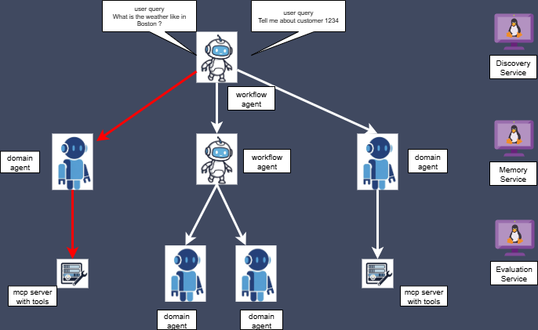

# 🚀 Build, Connect, and Orchestrate Intelligent Agents in Rust 🦀

## **Why Swarm?**

**Building complex, multi-agent systems is hard.** You need to handle communication, orchestrate tasks, and manage external tools. **Swarm makes it easy.**

Swarm is a Rust-based framework that allows you to build, connect, and orchestrate a network of specialized, intelligent agents. Think of it as a central nervous system for your digital workforce. Whether you need a customer service bot that can consult a shipping expert, or a data analyst that can delegate web scraping tasks, Swarm provides the backbone for them to collaborate seamlessly.

## **🌐 How It Works**

The diagram below illustrates how our agents, powered by MCP and A2A, interact under the guidance of the Full Agent. This architecture allows agents to communicate with each other to achieve sub-goals, connect to the outside world, and execute complex plans.

<p align="center" width="60%">
    
</p>

For a detailed description of Swarm's core components, refer to the "Core Components of Swarm" section below.

*(Note: An optional MCP Server is provided in the `examples` section for testing purposes.)*


## **🚀 Quickstart: Your First Swarm in 5 Minutes**

Follow these steps to get a multi-agent system running.

### Prerequisites

1.  **Install Rust**: If you don't have it, get it from [rust-lang.org](https://www.rust-lang.org/tools/install).
2.  **Get an LLM API Key**: Swarm agents need an LLM to think. We recommend starting with a free plan from [Groq](https://console.groq.com/keys) or [Google AI Studio (for Gemini)](https://aistudio.google.com/app/apikey). For a detailed comparison of the models we've tested, see our [Model Comparison Guide](./documentation/model_comparison/quick_comparison.md).

### Step 1: Clone and Build the Project

```bash
git clone https://your-repo-url/swarm.git
cd swarm
cargo build --release
```

### Step 2: Set Your API Keys

The quickstart scenario uses the Gemini API by default. Export your API key as an environment variable:

```bash
# Replace <YOUR-GEMINI-API-KEY> and <YOUR-GROQ-API_KEY> with your actual key
export LLM_A2A_API_KEY=<YOUR-GEMINI-API-KEY>
export LLM_MCP_API_KEY=<YOUR-GEMINI-API-KEY>
export LLM_FULL_API_KEY=<YOUR-GEMINI-API_KEY>
export LLM_JUDGE_API_KEY=<YOUR-GROQ-API_KEY>
```

### Step 3: Run the Demo!

We've prepared a script that launches a full orchestration scenario, including three specialized agents and one orchestrator.
The outcome is evaluated by another Llm acting as a judge

```bash
# This command must be run from the root of the swarm project
./documentation/use_case_combined_agents/run_all_commands.sh
```

You should now see logs from all agents as the orchestrator processes three sample requests. **Congratulations, you've just run your first swarm!**

To understand what just happened, feel free to inspect the configuration files in the `documentation/use_case_combined_agents` directory.


## **💡 Core Components of Swarm**

Swarm is built around three key intelligent agent components, and one component acting as a Judge to evaluate their results:

*   **Basic Domain Agent (The Specialist):** 🗣️ This is your workhorse. An agent designed to be an expert in a single domain, like "weather forecasting" or "database queries."
*   **Orchestration Agent (The Manager):** 🧠 This agent acts as a team lead. It takes a complex user request, breaks it down into smaller tasks, and delegates them to the appropriate Specialist agents. Because the Orchestrator Agent is also an A2A agent, this allows for the creation of complex, hierarchical agent swarms where agents can be a part of multiple orchestration layers.
*   **MCP Runtime (Model Context Protocol):** 🛠️ A powerful runtime that enables agents to interact with external services and data sources. Imagine your agents querying a weather API or accessing a database!
*   **LLM as a Judge:** 🛠️ A LLM that will evaluate outcome of orchestrator agents. We advise that you use a different LLM/Model thjan the one you use for agents and MCP. You can try it yourself through the demo we presented above. The evaluation data can be an interesting input for training / fine tuning LLM to improve accuracy of their answer, or the relevance of the tools you use.


## **⚙️ Configuration Details**

The `configuration` directory is your go-to for customizing agent behavior. Here's a quick overview:

| File Name                | Purpose                                                                                |
| :----------------------- | :------------------------------------------------------------------------------------- |
| `agent_basic_config.toml`| Configures simple domain agents, including optional embedded MCP agents                |
| `agent_mcp_config.toml`  | Configures the MCP runtime settings.                                                   |
| `agent_orchestration_config.toml` | Configures the Orchestrator Agent, including capabilities of using tools and skills                                                                                                              |
| `agent_judge_config.toml`| FUTURE USE :Configures for the judge agent that will be used for evaluation service   |

**LLM Models:** Each agent can connect to its own LLM. URLs are parameterized in the config files, while API keys need to be injected at runtime as environment variables.

*(To enable MCP features, an MCP server must be running and configured in toml files. You can find one in the `examples` for testing.)*

## **🚀 Launching Your Agents Manually or Programmatically**

Getting your Swarm agents up and running is straightforward. For maximum flexibility and programmatic control, you can launch individual agents directly. Remember to set the required API key environment variables (e.g., `LLM_A2A_API_KEY`, `LLM_FULL_API_KEY`, `LLM_MCP_API_KEY`) *before* running these commands.

*   **Basic Domain Agent:** Your individual intelligent assistant specialized in a single domain

    Via Script :

    ```bash
    # Run compiled binary.
    # LLM_A2A_API_KEY: API Key for the A2A agent's LLM.
    # LLM_MCP_API_KEY: Optional API Key for the embedded MCP Runtime's LLM (can be the same as A2A).
    # Both API keys must be compatible with llm_url defined in the config file.
    # You can define log level (default is "warn").
    ./target/release/basic_agent_launch --config-file "configuration/agent_basic_config.toml" --log-level "warn"
    ```

    Or programmatically, in just a few lines of code :

    ```rust
    // load config file
    let basic_agent_config = AgentConfig::load_agent_config(&args.config_file);

    // Create the modern server, and pass the runtime elements
    let server = AgentServer::<BasicAgent>::new(basic_agent_config.expect("Incorrect Basic Agent config file")).await?;

    println!("🌐 Starting HTTP server only...");
    server.start_http().await?;
    ```


*   **Orchestrator Agent:**  This agent can connect to other agents and MCP tools to achieve its goals.

    Via Script :

    ```bash
    # Run compiled binary.
    # LLM_FULL_API_KEY: API Key for the Full Agent's LLM.
    # LLM_MCP_API_KEY: Optional API Key for the embedded MCP Runtime's LLM (can be the same LLM as Full Agent).
    # Both API keys must be compatible with llm_url defined in the config file.
    # You can define log level (default is "warn").
    ./target/release/orchestration_agent_launch --config-file "configuration/agent_orchestration_config.toml" --log-level "warn"
    ```
    Or programmatically, in just a few lines of code :

    ```rust
    // load config file
    let basic_agent_config = AgentConfig::load_agent_config(&args.config_file);

      // Create the modern server, and pass the runtime elements
    let server = AgentServer::<OrchestrationAgent>::new(orchestration_agent_config.expect("Incorrect Orchestration Agent config file")).await?;

    println!("🌐 Starting HTTP server only...");
    server.start_http().await?;
    ```

## **🔬 Under the Hood: Swarm.rs Crate Breakdown**

The Swarm project is composed of several specialized sub-crates, each serving a distinct purpose:

*   `agent_discovery_service`: An optional HTTP service where agents can register themselves. It exposes an endpoint to list all available agents, facilitating dynamic discovery.
*   `agent_memory_service`: A Work In Progress capability for all agents to share their interactions and ensure better coordination.
*   `agent_evaluation_service`: A Work In Progress capability for all agents to have their performance evaluated ( Llm as a Judge Model).
*   `configuration`: Contains Default Location of Swarm configuration files, making it easy to customize agent behavior.
*   `agent_protocol_backbone`: Contains foundational elements to launch an agent and enable its request processing capabilities.
*   `basic_agent`: Provides Business logic to launch a basic agent.
*   `orchestration_agent`: Provides Business logic to launch an orchestration agent.
*   `mcp_runtime`: A runtime to connect to a ModelContextProtocol Server. Designed to be embedded into an agent
*   `llm_api`: Offers a convenient interface for interacting with various Large Language Models via an OpenAI-compatible API.
*   `documentation`: Contains a series of example of toml config file for all sort of agents ( weather forecast, customer domain, web scraper, joke telling,...).
*   `examples`: Contains multiple illustrative examples to help you interact with Swarm:
    *   `mcp_agent_endpoint`: A testing utility for an MCP runtime to receive and process requests through an MCP server.
    *   `a2a_agent_endpoint`: A testing utility to interact directly with an A2A agent via a REST API. Also includes a simple UI for testing your configuration.
    *   `mcp_server`: A basic MCP server exposing three tools, primarily for testing purposes. You can start separately one instance on one port with one of these three tools ( weather, customer, url scraping), or the three tools together.

## **🗺️ Road Ahead & How You Can Contribute**

Swarm is currently a project for discovery and exploration! While not production-ready, it's a fantastic playground for understanding how these protocols can be combined to build powerful agentic systems. We are actively enhancing its capabilities and robustness.

We're continuously working on improvements, including:

*   **Memory & State Management** Capability to store all request from all agents, and to facilitate communication through the agent network.
*   **Dynamic Discovery:** Enable agents to understand dynamically what relevant skills are available to define an execution plan.
*   **Context Enrichment:** Enrich the request with relevant context, to make a plan more accurate.
*   **Evaluation:** Evaluation of the outcome of the swarm of agents, to enable distributed iterative decision processing ( test and learn).
*   **Identity Management:** Use Self Sovereign Identity concept to enable agent to have its own proven identity.
*   **Directed Graph of Agents:** Connect agents in a pre defined pipeline to execute complex tasks.
*   **Code Refactoring:** Continuously improving code clarity and maintainability.
*   **Unit Tests:** Enhancing robustness and reliability across the codebase.
*   **Scalable & Asynchronous Communication** Leveraging Tokio to enable agents to process requests from multiple clients in parallel.
*   **Improved UI** Improve the UI to interact with any kind of agent.
*   **Test with Llama.cpp Server** Test with llama.cpp server so that we can connect all kind of fine tuned models for single domain agents.

## **🤝 How to Contribute**

We welcome contributions of all kinds! Whether you're a developer, a writer, or just have a great idea, we'd love to have you.

Here are a few ways you can help:

1.  **Report Bugs**: If you find a bug, please [open an issue](https://github.com/your-repo-url/swarm/issues) and provide as much detail as possible.
2.  **Suggest Features**: Have an idea for a new feature? We'd love to hear it! [Open an issue](https://github.com/your-repo-url/swarm/issues) to start the discussion.
3.  **Submit Pull Requests**: If you're ready to contribute code, please fork the repository and submit a pull request. We recommend starting with issues labeled `good first issue`.
4.  **Improve the Documentation**: If you see an area where the documentation could be better, please don't hesitate to make the change and submit a pull request.

Before contributing, please read our (coming soon) `CONTRIBUTING.md` file for more detailed guidelines.


We're eager for your comments, suggestions, and contributions!
Whether it's a bug report, a feature idea, or a pull request, your input helps shape the future of Swarm.

You an also contribute by suggesting configuration files that you have been using to support your use case, as well as models you have been using for your experimentations

Join our community and help us build the next generation of intelligent agent orchestration!

## **⭐ Show Your Support**

If you find Swarm useful or interesting, please consider starring our repository! Your support helps us continue to develop and improve this project.

## **🙏 Special Thanks**

We heavily rely on and appreciate the fantastic work of these actively developed crates:

*   **MCP Protocol:** [https://github.com/modelcontextprotocol/rust-sdk](https://github.com/modelcontextprotocol/rust-sdk)
*   **A2A Protocol:** [https://github.com/EmilLindfors/a2a-rs](https://github.com/EmilLindfors/a2a-rs)

*Note: Due to their active development, we pin to recent ( but fixed revision ) in `Cargo.toml` to maintain stability.*
