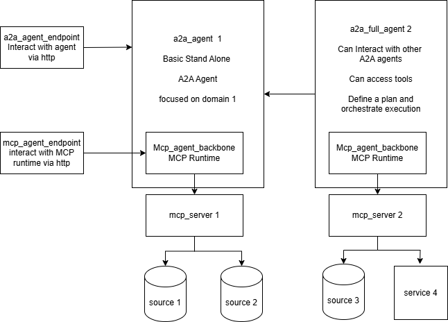

# **Swarm: Orchestrating Intelligent Agents in Rust 🦀**

## **Welcome to Swarm\!**

Swarm.rs is a Rust project that empowers you to build and orchestrate intelligent agents. Think of it as a control center for your digital assistants, allowing them to communicate, collaborate, and tackle complex tasks together.

We combine two powerful communication protocols ( MCP and A2A) , and an orchestration capability:

* MCP (Model Context Protocol): For agents to interact with external services and data sources. Imagine your agents querying a weather API or accessing a database\!  

* A2A (Agent-to-Agent Protocol): A very simple autonomous A2A agent, that can implement a MCP runtime.

* A Full A2A Agent. It can connect to various other A2A agents. It can implement a MCP runtime. It creates a plan based on tools and skills available in order to fulfill the request.

Whether you're a Rust enthusiast, an AI developer, or just curious about multi-agent systems, we invite you to explore Swarm\!

## **Why Swarm?**

* Rust-powered performance and safety: Build robust and efficient agent systems.  
* Flexible architecture: Easily integrate with external services and create collaborative agent networks.  
* Intuitive orchestration: The Planner simplifies complex multi-agent workflows.  
* Open for collaboration: We're actively developing and welcome your ideas and contributions\!

## **How It Works: A Glimpse into the Architecture**

The diagram below illustrates how our agents, powered by MCP and A2A, interact under the guidance of the Planner.

<p align="center" width="80%">
    
</p>

* MCP RunTime: Enable  agents to connect to the outside world (e.g., fetching real-time data, interacting with APIs).  

* A2A Agents: Agents that specialize in specific tasks, an can embed an MCP runtime. 

* Full Agent: He is also an A2A agents. He can access skills from other agents, and tools from MCP middleware. It understands the overall goal, breaks it down, and directs the A2A agents to execute the plan.Through this, agents can communicate with each other to achieve sub-goals.  Because of its architecture, it can implement if needed complex agentic network design

If needed for experimentation purpose, an MCP Server is provided in the examples section.

## **Getting Started: Join the Swarm\!**

Ready to dive in? Here's how to get your first Swarm.rs components up and running.

### **Prerequisites**

To enable your agents to think and communicate, you'll need access to an OpenAI-compatible chat completion API.

* Our recommendation for speed: [Groq](https://api.groq.com/openai/v1/chat/completions) (we've had great success with the qwen/qwen3-32b model).  

* Also tested with: [Gemini](https://generativelanguage.googleapis.com/v1beta/openai/chat/completions).


### **Building swarm**

First, compile the workspace to ensure all dependencies are in sync:
```bash
cargo build --release
```

### **Configuration Details**

The configuration directory is your go-to for customizing agent behavior:

*   `agent_a2a_config.toml`: Configuration for A2A server agents. ( They can embed mcp agents)
*   `agent_mcp_config.toml`: Configuration for MCP runtime.
*   `agent_full_config.toml`: Configuration for the full agent.

LLM Models:  We've found `qwen/qwen3-32b` to be highly effective, especially for MCP interactions.  

Each model can access to its own LLM. The urls are parametrized in config files while API KEY needs to be injected at runtime.

To enable MCP features, you need to have an MCP server up and running. There is one in examples in case you need one for testing purpose


## **Manual Launching of Agents**

Now, let's fire up some agents\!

* A2A Agent Server (your individual intelligent assistants):  
  You can run multiple A2A agents, each with its own configuration.  ( In the example, the a2a agent embeds a MCP agent )

```bash
  # Run compiled binary.
  # LLM_A2A_API_KEY (for normal agent) and LLM_MCP_API_KEY (for mcp embedded if any) needs to be defined upfront
  # They need to be compatible with llm_url defined in config file for a2a agents and mcp runtime(Gemini, Groq or whatever else that you use) 
  # You can define log level as well. Default Level is warn
  ./target/release/simple_agent_server --config-file "configuration/agent_a2a_config.toml" --log-level "warn"
```


* Full Agent Server .(Integrated agent, still WIP):  
  Ask the Planner to achieve a goal by providing a user query.  

```bash
  # Run compiled binary.
  # LLM_FULL_API_KEY needs to be defined upfront.
  # LLM_MCP_API_KEY needs to be defined upfront if an MCP is embedded in Full agent
  # It needs to be compatible with llm url defined in config file for planner agent (Gemini, Groq or whatever else that you use) 
  # You can define log level as well. Default is warn
  ./target/release/full_agent_server
```


## **Under the Hood: Swarm.rs Crate Breakdown**

The swarm project is composed of several specialized sub-crates:

* `a2a_agent_backbone`: A very simple A2A agent. If needed it can incorporate MCP runtime for external interactions. It can be connected to its own LLM 
* `a2a_full_backbone`: An agent that can connect to other agents AND also use tools directly. It connects to declared A2A agents, understands their skills, connect to MCP server, and understand its tools, then  creates a plan, and executes it to achieve your goals. Available as a standalone agent, as well as an A2A agent server. It can be connected to its own LLM 
* `configuration`: Manages all your Swarm.rs configuration files.  
* `llm_api`: Provides a convenient interface for interacting with various Large Language Models via an OpenAI-compatible API.  
* `mcp_agent_backbone`: A runtime to interact with MCP server. Designed to be integrated into an A2A agent, granting him capability to connect to external set of tools. The MCP runtime can be connected to its own LLM. Note: An external mcp\_server (like the illustrative project or Apify) is needed for these agents to function.  
* `agent_discovery_service`: An optional http service. Each agent register to this service. It then exposes an endpoint to list all available agents.  
* `examples`: Contain mulitple illustrative examples to interact with swarm
    * `mcp_agent_endpoint`: A testing utility for MCP runtime to receive and process requests through a MCP server. 
    * `mcp_a2a_endpoint`: A testing utility to interact directly with an A2A agent through rest API
    * `mcp_server`: A MCP server exposing three tools, mostly for testing purpose. 

## **Road Ahead & How You Can Contribute**

Swarm.rs is a project born out of discovery and exploration\! While not production-ready, it's a fantastic playground for understanding how these protocols can be combined to build powerful agentic systems.

We're continuously working on improvements, including:

* Implementation of a simple UI for testing purpose, to interact with an a2a agent ( simple server  or planner server)
* Refactoring: Continuously improving code clarity and maintainability.  
* Unit Tests: Enhancing robustness and reliability.

We're eager for your comments, suggestions, and contributions\! Whether it's a bug report, a feature idea, or a pull request, your input helps shape the future of Swarm.rs.

## **Special Thanks**

We heavily rely on and appreciate the fantastic work of these actively developed crates:

* MCP Protocol: [https://github.com/modelcontextprotocol/rust-sdk](https://github.com/modelcontextprotocol/rust-sdk)  
* A2A Protocol: [https://github.com/EmilLindfors/a2a-rs](https://github.com/EmilLindfors/a2a-rs)

*Note: Due to their active development, we might occasionally pin to specific commits in Cargo.toml to maintain stability.*