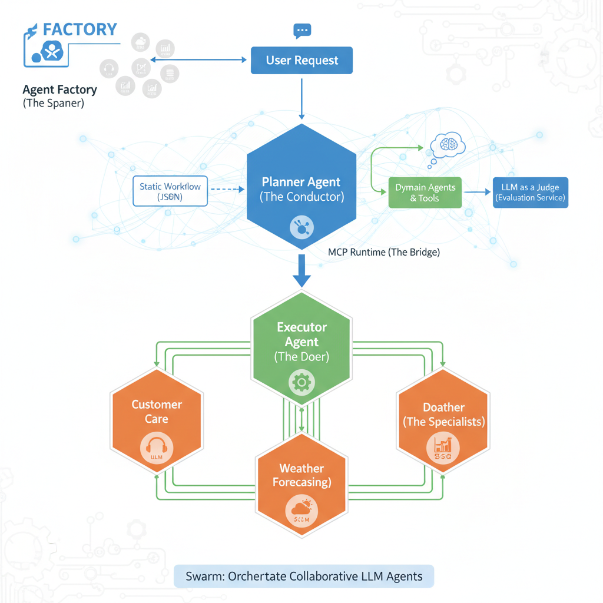
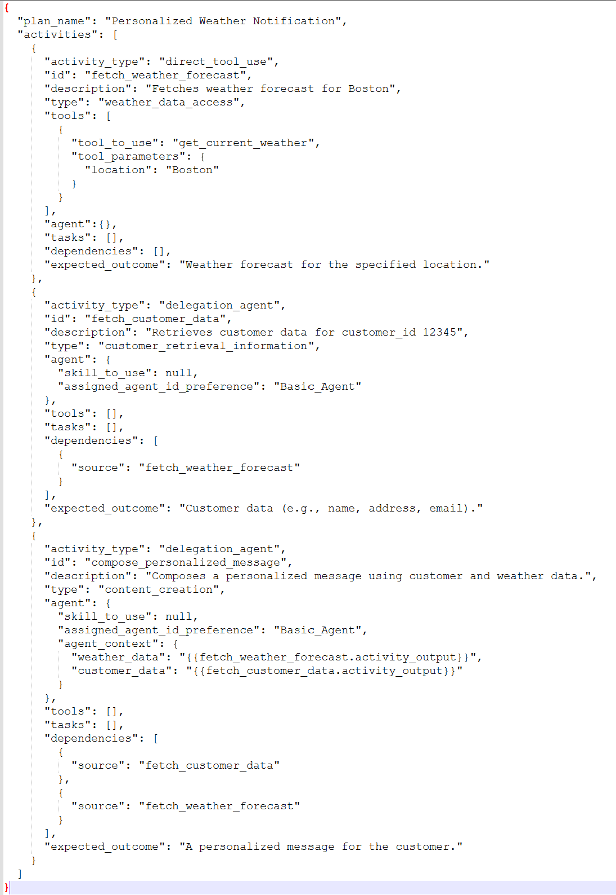
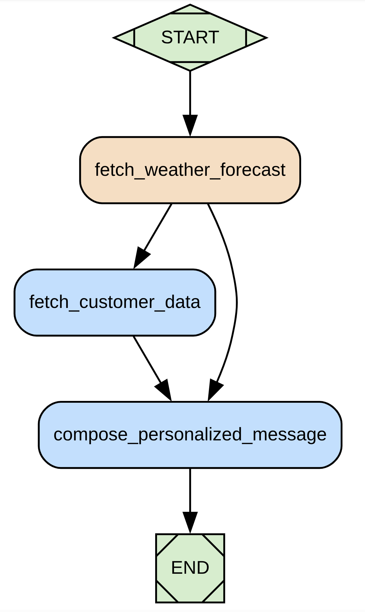
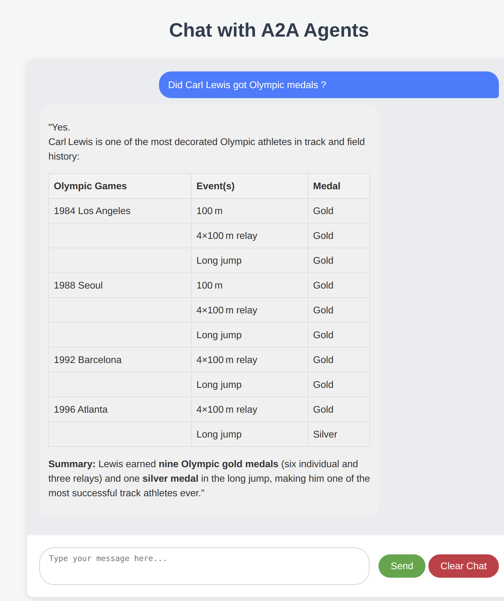

# 🚀 Swarm: A Framework for Building and Orchestrating Intelligent Agents in Rust 🦀

> **Swarm** is a Rust framework for creating and managing a network of specialized, intelligent agents that collaborate through flexible workflows. It acts as a central nervous system for your digital workforce, allowing you to orchestrate complex tasks, either by executing predefined plans or by generating them dynamically.

*   **Self-Correcting Workflows:** Automated planning and execution, refined through a built-in LLM-as-a-Judge evaluation system.
*   **Dynamic Scaling:** Use the Agent Factory to programmatically instantiate and manage specialist agents at runtime.
*   **Open Standards Focus:** Built around the Model Context Protocol (MCP) and Agent-to-Agent (A2A) protocols for robust, interoperable communication.

<p align="center" width="60%">
    
</p>

## **Why Swarm?**

Building multi-agent systems is complex... Swarm simplifies this by providing the backbone for agents to collaborate seamlessly, allowing you to focus on building intelligent solutions, not on the plumbing. Built in Rust, Swarm delivers the memory safety, concurrency, and performance essential for scalable, production-grade AI services.

---

## **How It Works**


Swarm's architecture is designed around a collaborative "conductor" and "specialist" model, facilitating efficient execution of complex tasks:

1.  **User Request & Planning (Planner Agent - The Conductor, Part 1):**
    *   A user initiates a request, which is received by the **Planner Agent** (or an **Agent Factory** can directly launch an agent to handle the request).
    *   The Planner Agent, acting as the primary orchestrator, determines the optimal course of action. It can:
        *   Load a predefined plan ("static workflow") from a JSON file.
        *   Dynamically generate a new plan ("dynamic workflow") by evaluating the capabilities of available **Domain Agents, Tools, or Tasks** (or by instructing an **Agent Factory** to instantiate the necessary agents).
    *   Once a plan is established, it is passed to the **Executor Agent**.

2.  **Execution & Evaluation (Executor Agent - The Doer; Planner Agent - The Conductor, Part 2):**
    *   The **Executor Agent** receives the plan from the Planner Agent and meticulously executes each step. This involves coordinating with **Domain Agents** and utilizing various tools through the **MCP Runtime**. The Executor Agent reports the outcome of the execution back to the Planner Agent.
    *   For **dynamic plans**, the **Planner Agent** then takes this outcome and, using an integrated **LLM-as-a-Judge** system via the **Evaluation Service** (provided by `swarm_services`), critically assesses the execution's success. If the evaluation score is unsatisfactory, the Planner Agent can leverage this feedback to refine the plan, potentially regenerating and re-executing an improved workflow. This creates a powerful feedback loop for continuous improvement in dynamic scenarios.

3.  **Specialized Task Handling (Domain Agents - The Specialists):**
    *   **Domain Agents** are the core "workers," each specializing in a particular domain (e.g., customer care, weather forecasting, data analysis).
    *   Each Domain Agent is powered by its own Large Language Model (LLM) and equipped with a dedicated set of tools to accomplish its specific tasks, responding to directives from the Executor Agent.

This modular and iterative structure enables the creation of sophisticated multi-agent systems where a central orchestrator efficiently delegates, executes, and refines tasks through a team of specialized, intelligent agents.

---

## **🚀 Quickstart: Launch Your First Swarm in 5 Minutes**

### Prerequisites

1.  **Install Rust**: If you don't have it already, download and install it from [rust-lang.org](https://www.rust-lang.org/tools/install).
2.  **Get an LLM API Key**: Swarm agents require an LLM to function. We recommend obtaining a free API key from [Groq](https://console.groq.com/keys) or [Google AI Studio (for Gemini)](https://aistudio.google.com/app/apikey). It can also connect to a local llama.cpp openai compatible server instance

### Step 1: Clone and Build the Project

```bash
git clone https://github.com/fcn06/swarm.git
cd swarm
cargo build --release
```

### Step 2: Set Your LLM API Keys

The quickstart demo utilizes LLMs for various agent roles. For simplicity, you can use the *same* API key for all roles, especially when starting with Groq.

```bash
# Replace <YOUR-LLM-API-KEY> with your actual API key.
# For the pre configured demo below, we use groq provider. ( https://groq.com/)
export LLM_A2A_API_KEY=<YOUR-LLM-API-KEY>       # For general Agent-to-Agent communication
export LLM_MCP_API_KEY=<YOUR-LLM-API-KEY>       # For Model Context Protocol interactions
export LLM_JUDGE_API_KEY=<YOUR-LLM-API-KEY>     # For the LLM-as-a-Judge evaluation service
export LLM_PLANNER_API_KEY=<YOUR-LLM-API-KEY>     # For the Planner Agent
```

### **Step 3: Explore Swarm's Power - Two Paths to Orchestration!**

Swarm offers you two primary ways to experience its agent orchestration capabilities, both designed for quick experimentation. Think of them as two sides of the same coin, each with a dedicated quickstart script to get you up and running instantly.

#### **Path 1: Workflow-Driven Orchestration (The Planner & Executor in Action)**

This path showcases Swarm's robust workflow management, where a Planner Agent designs tasks and an Executor Agent brings them to life. You can either use a predefined "static" plan or witness the Planner dynamically generate a workflow based on your query and the available agents' skills.

*   **Dynamic Workflow Generation:** This mode dynamically generates an execution plan based on your query and the skills of available agents. It highlights Swarm's adaptive planning capabilities.
    ```bash
    # This command must be run from the root of the swarm project
    sh ./documentation/demo_planner_executor_management/run_all_commands.sh --dynamic-generation
    ```

    Once the agents are launched, to interact with them, you can use a simple A2A client, that passes the appropriate metadata to initiate workflow generation mechanism. You will need to adjust the port to your planner agent.
    ```bash
    ./target/release/simple_workflow_agent_client --port 9580 --log-level "warn" --generation-type "dynamic_generation" --user-query "Compare Bach and Vivaldi ?"
    ```

*   **Static Workflow (Default):** This executes a predefined workflow loaded from a JSON file. Ideal for predictable and repeatable processes.
    ```bash
    # This command must be run from the root of the swarm project
    sh ./documentation/demo_planner_executor_management/run_all_commands.sh
    ```
As an illustration, here is what we can define in a JSON workflow :

<p align="center" width="60%">
    
</p>

Which can be visually represented by :

<p align="center" width="20%">
    
</p>

**Important: Stopping Services for Path 1**
After running the workflow-driven orchestration demo, use this command to stop all active agent processes:

```bash
# This command must be run from the root of the swarm project
sh ./documentation/demo_planner_executor_management/terminate_all_agents_process.sh
```

#### **Path 2: Agent Factory - Programmatic Agent Launch**

Dive into the heart of dynamic agent creation with the `AgentFactory`! This path lets you programmatically launch and manage agents on-the-fly, giving you the power to build flexible and scalable multi-agent systems where agents can be instantiated as needed. The `AgentFactory` seamlessly integrates with the **MCP Runtime**, ensuring newly created agents instantly become part of your Swarm ecosystem.

Here's a code snippet illustrating how to launch a "Basic_Agent" with `mcp_runtime` configuration:

```rust
      let agent_api_key = env::var("LLM_A2A_API_KEY").expect("LLM_A2A_API_KEY must be set");

    let factory_mcp_runtime_config = FactoryMcpRuntimeConfig::builder()
        .with_factory_mcp_llm_provider_url(LlmProviderUrl::Groq)
        .with_factory_mcp_llm_provider_api_key(agent_api_key.clone())
        .with_factory_mcp_llm_model_id("openai/gpt-oss-20b".to_string())
        .with_factory_mcp_server_url("http://localhost:8000/sse".to_string())
        .with_factory_mcp_server_api_key("".to_string())
        .build().map_err(|e| anyhow::anyhow!("Failed to build FactoryMcpRuntimeConfig: {}", e))?;

    let factory_agent_config = FactoryAgentConfig::builder()
        .with_factory_agent_url("http://127.0.0.1:8080".to_string())
        .with_factory_agent_type(AgentType::Specialist)
        .with_factory_agent_domains(AgentDomain::General)
        .with_factory_agent_name("Basic_Agent".to_string())
        .with_factory_agent_id("Basic_Agent".to_string())
        .with_factory_agent_description("An Agent that answer Basic Questions".to_string())
        .with_factory_agent_llm_provider_url(LlmProviderUrl::Groq)
        .with_factory_agent_llm_provider_api_key(agent_api_key)
        .with_factory_agent_llm_model_id("openai/gpt-oss-20b".to_string())
        .build().map_err(|e| anyhow::anyhow!("Failed to build FactoryAgentConfig: {}", e))?;

    agent_factory.launch_agent_with_mcp(&factory_agent_config,&factory_mcp_runtime_config,AgentType::Specialist).await?;

```

**Quickstart Script for Agent Factory:** To get a taste of this dynamic agent creation, we've provided a script that launches a self-sustainable ecosystem with a Domain Agent, a Planner, and an Executor – all orchestrated by the Agent Factory.

```bash
# Demo of Agent Factory. Will launch one Domain Agent ( with MCP), One Planner ( connected to agents, tools and tasks)
# and one Executor
sh ./documentation/demo_factory/run_all_commands.sh
```

There is also another repository called **swarm_factory** [https://github.com/fcn06/swarm_factory](https://github.com/fcn06/swarm_factory) that demonstrate how you can use swarm to kickstart and manage an agent factory

This capability is essential for creating adaptive systems that can scale their workforce based on the tasks at hand, ensuring proper integration and communication through the **MCP Runtime**.

**Important: Stopping Services for Path 2**
After running the Agent Factory demo, use this command to stop all active agent processes:

```bash
# This command must be run from the root of the swarm project
sh ./documentation/demo_factory/terminate_all_agents_process.sh
```

---

**Congratulations, you've just run your first swarm!**

---

## **💡 Other Examples**

You can interact with your agent system through a UI , and will find examples in [./documentation/Sample_Scenarios/scenario_ui.txt](./documentation/Sample_Scenarios/scenario_ui.txt)

<p align="center" width="60%">
    
</p>

You can find other real world scenarios in [./documentation/Sample_Scenarios/scenario_1.txt](./documentation/Sample_Scenarios/scenario_1.txt)

You can find concrete example of workflow in [./documentation/Sample_Scenarios/mix_agent_tools_workflow.json](./documentation/Sample_Scenarios/mix_agent_tools_workflow.json)

---

## **💡 Core Components of Swarm**

Swarm leverages a modular architecture, building upon shared foundational crates and dedicated infrastructure services to enable robust multi-agent systems.

### Foundational Building Blocks (from `swarm_commons`)
For core abstractions, common models, configuration, and LLM interaction, Swarm relies on the `swarm_commons` project.
*   **Agent Core Logic:** Fundamental traits and business logic for agents.
*   **Agent Models:** Shared data structures for communication and state.
*   **Configuration:** Centralized management of settings and prompts.
*   **LLM API Integration:** Standardized interfaces for interacting with Large Language Models.
[Learn more about Swarm Commons here.](./codebase/swarm_commons/README.md)

### Core Infrastructure Services (from `swarm_services`)
For essential backend functionalities that enable agents to collaborate, discover each other, manage memory, and evaluate performance, Swarm integrates with `swarm_services`.
*   **Agent Discovery Service:** Enables agents to register and discover others.
*   **Agent Memory Service:** Manages shared conversational history and context.
*   **Agent Evaluation Service (LLM as a Judge):** Critically assesses agent performance and workflow outcomes.
*   **Agent Service Adapters:** Client implementations for agents to interact with these services.
[Learn more about Swarm Services here.](./codebase/swarm_services/README.md)


### Orchestration & Logic (The Brains - within `Swarm` itself)
*   **✍️ Planner Agent (The Architect):** This specialized agent is the first part of the "Conductor." It focuses on generating detailed, step-by-step execution plans or workflows based on a high-level goal, which are then passed to the Executor Agent.
*   **🔗 Workflow Mgmt Runtime (The Engine):** This flexible core is responsible for defining, validating, and executing multi-agent workflows and plans. It is the underlying mechanism leveraged by the Executor Agent to manage the execution of planned tasks.

### Execution & Agent Types (The Body - within `Swarm` itself)
*   **🏃 Executor Agent (The Doer):** Completing the "Conductor" role, this agent takes an execution plan from the Planner, carries out the individual tasks by interacting with tools and other agents, and integrates with the LLM-as-a-Judge system (via `swarm_services`) for continuous evaluation and potential workflow refinement.
*   **🏭 Agent Factory (The Spawner):** This component allows for the dynamic, programmatic creation and management of agent instances at runtime, facilitating scalable and adaptive multi-agent systems.
*   **🗣️ Domain Agents (The Specialists):** These are specialized agents, each acting as an expert in a particular domain (e.g., weather forecasting, database queries, customer care). They execute specific tasks as directed by the Executor Agent.
*   **🛠️ MCP Runtime (The Bridge):** This component facilitates seamless agent interaction with external services, tools, and diverse data sources, effectively extending the agents' capabilities to the outside world.

---

## **🗺️ Roadmap & Contributing**

Swarm is an active project, and we are constantly working on improvements. Our roadmap includes:

*   **Enhanced Workflow Features:** More advanced conditional logic.
*   **Create an Identity Agent, using Self Sovereign Identity:** This agent would be able to sign a request, validate a signed request, pass the validated request to another agent for execution. Probably will be in a separate and dedicated crate
*   **Improved Observability:** Better logging, tracing, and monitoring.
*   **Broader LLM Integration:** Compatibility with a wider range of LLMs.

### **🤝 How to Contribute**

We welcome contributions! Whether you're a developer, a writer, or have a great idea, we'd love to have you. The best way to start is by opening an issue to discuss your ideas.

---

## **⭐ Show Your Support**

If you find Swarm useful, please consider starring our repository! Your support helps us grow.

---

## **🙏 Special Thanks**

We rely on the fantastic work of these actively developed crates:

*   **MCP Protocol:** [https://github.com/modelcontextprotocol/rust-sdk](https://github.com/modelcontextprotocol/rust-sdk)
*   **A2A Protocol:** [https://github.com/EmilLindfors/a2a-rs](https://github.com/EmilLindfors/a2a-rs)
