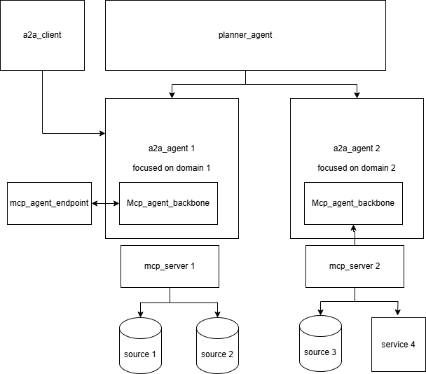

# Swarm Crate

The `swarm` crate is a Rust implementation of an agentic swarm. It facilitates the connection and interaction between agents using two primary protocols: MCP (Microservice Communication Protocol) and A2A (Agent-to-Agent) protocol. This swarm is designed to be complemented by a planner, allowing for the orchestration and management of multiple agents to achieve complex goals.

## Architecture

The overall architecture of the agentic swarm, illustrating the interaction between MCP and A2A protocols and the role of the planner, is depicted in the following diagram:



## Getting Started

To run components of the swarm, you will need to configure access to an OpenAI compatible chat completion API. \

Create a `.env` file in the project root with the following structure: \
\
For groq
```
LLM_API_KEY=your_api_key
LLM_API_URL=your_api_base_url # e.g., https://api.groq.com/openai/v1/chat/completions
```
\
Groq is a personal preference due to its speed. ALong with the model : qwen/qwen3-32b \
\
It is tested also on Gemini ( with LLM_API_URL= https://generativelanguage.googleapis.com/v1beta/openai/chat/completions)
\

It is recommended to have an `mcp_server` running to allow the agents to interact with external services or information sources. \
The `mcp_server` project is typically a separate but complementary component.

## Running Components

You first need to compile the workspace (before you execute cargo run. This will force update Cargo.lock)
```
bash
    cargo build 
    
```

Then You can execute various components of the swarm using `cargo run`:

*   **A2A Agent Server:** ( You can create multiple agents , each one linked to a different config file)
```
bash
    cargo run --bin simple_agent_server -- --config-file "configuration/agent_a2a_config.toml"
    
```
*   **Planner:**
```
bash
    cargo run --bin planner_agent -- --user-query "What is the weather in Boston ?"
    
```
Replace `"What is the weather in Boston ?"` with your desired user query.

## Configuration

The `configuration` directory contains three important configuration files:

*   `agent_a2a_config.toml`: Configuration for A2A agents.
*   `agent_mcp_config.toml`: Configuration for MCP agents.
*   `agent_planner_config.toml`: Configuration for the planner agent.

These files allow you to customize the behavior and settings of each agent type.

For interacting with MCP , from my perspective, the qwen model is very efficient. 
The one I use regularly is : model qwen/qwen3-32b

## Use different LLM per agent type

For now a2a agent and mcp agent needs to run on the same LLM
\
Planner agent can be run on a different LLM. LLM_API_URL can be defined in `agent_planner_config.toml`


## Crates within the Swarm

The `swarm` crate is composed of several sub-crates, each with a specific target or function:

*   **`a2a_agent_backbone`**: Provides the core logic and framework for A2A agents. They can incorporate mcp agents, to interact with mcp server. It contains a server agent ( to launch a standalone a2a agent) and a client endpoint , mostly for testing purpose to interact with the a2a agent via rest endpoint
*   **`a2a_planner_backbone`**: Provides the core logic and framework for the A2A planner. The planner agent connects to multiple a2a agents and orchestrates their interactions. The planner will connect to the declared a2a agents, and based on the skills, will create a plan, and execute the plan through the a2a agents in order to get the outcome.
*   **`configuration`**: Handles the loading and management of configuration files for all swarm components.
*   **`llm_api`**: Provides an interface for interacting with Large Language Models (LLMs) via an OpenAI compatible API.
*   **`mcp_agent_backbone`**: Provides the core logic and framework for MCP agents. You need to declare an mcp server. I created an illustrative project for testing purpose. I also use apify as a mcp server for more sophisticated capabilities.
*   **`mcp_agent_endpoint`**: Mostly for testing purpose : Provides an executable endpoint for MCP agents to receive and process requests.

## Next Steps

This crates is not intended for production, but rather for discovery of how these protocols could be used in combination
There are some shortcuts in implementation, and I will continue work on improvements

Some of the further identified steps are also :
Create a possibility for recursivity ( to have a planner of planner). This would be done by creating a server planner and a planner agent
Refactoring
Implementing unit tests

I am interested in any comments and suggestions.


## Nota Bene

I am heavily using two crates that are in active development. \
\
For mcp propocol : \
https://github.com/modelcontextprotocol/rust-sdk \
\
For a2a protocol : \
https://github.com/EmilLindfors/a2a-rs \ 
\
\
I may have to point out in Cargo.toml a specific commit , in case there are too many breaking changes
