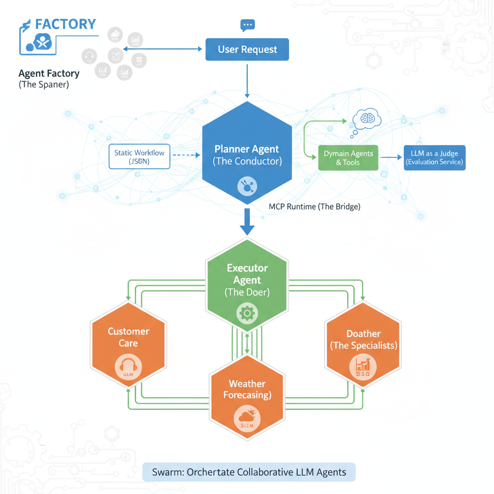

# 🚀 Swarm: A Framework for Building and Orchestrating Intelligent Agents in Rust 🦀

> **Swarm** is a Rust framework for creating and managing a network of specialized, intelligent agents that collaborate through flexible workflows. It acts as a central nervous system and multi-model gateway for your digital workforce, allowing you to orchestrate complex tasks, either by executing predefined plans, generating them dynamically, or serving as a high-performance stateful proxy between IDEs/clients and upstream model platforms.

*   **Self-Correcting Workflows:** Automated planning and execution, refined through a built-in LLM-as-a-Judge evaluation system.
*   **Dual-Mode Gateway (`swarm_server`):** Native support for the Open Responses specification (`POST /v1/responses`) alongside stateless backward-compatibility (`POST /v1/chat/completions`) and outbound Google `/v1/interactions`.
*   **Dynamic Scaling:** Use the Agent Factory to programmatically instantiate and manage specialist agents at runtime.
*   **Open Standards Focus:** Built around the Model Context Protocol (MCP), Agent-to-Agent (A2A), and Open Responses protocols for robust, interoperable communication.

<p align="center" width="60%">
    
</p>

## **1. Target Architecture & Data Flow**

```
+--------------------------------------------------------------------------------------------------+
|                                  CLIENT LAYER (IDE / EDITORS)                                    |
|   Stateless IDE Extensions (POST /v1/chat/completions)  |  Modern Agent SDKs (POST /v1/responses)  |
+-------------------------------------------+------------------------------------------------------+
                                            |
                                            v
+--------------------------------------------------------------------------------------------------+
|                                    fcn06/swarm (GATEWAY ENGINE)                                  |
|                                                                                                  |
|  1. INBOUND ADAPTERS                                                                             |
|     • POST /v1/chat/completions (Normalized to internal ResponseItem)                           |
|     • POST /v1/responses        (Native Open Responses format)                               |
|                                                                                                  |
|  2. CORE SESSION & STATE ENGINE (SessionStore)                                                   |
|     • Session mapping & prefix KV cache optimization                                             |
|     • Polymorphic ResponseItem state (Message, FunctionCall, FunctionOutput, Thought)            |
|                                                                                                  |
|  3. AGENT ORCHESTRATOR & LOCAL MCP ENGINE                                                        |
|     • Rust agent execution loop (Planner -> Executor -> Judge)                                  |
|     • Direct MCP tool execution (stdio/SSE)                                                      |
|                                                                                                  |
|  4. OUTBOUND ADAPTER LAYER (swarm_commons::llm_api)                                             |
|     • Converts ResponseItem state to downstream target protocol schemas                        |
+-------------------┬──────────────────────────────────┬───────────────────────────────────┤
                    │                                  │                                   │
                    v                                  v                                   v
        POST /v1/chat/completions              POST /v1/responses                  POST /v1/interactions
  (Corporate Proxies)                          (OpenAI Upstream)                   (Google Gemini Platform)
```

---

## **🌐 Swarm Gateway Server (`swarm_server`)**

> **Note**: These architectural changes (Open Responses specification, stateful turn tracking with `SessionStore`, and outbound adapters) will enable Swarm to act as a unified, high-performance **model gateway** to various models (Google Gemini, OpenAI, Groq, local LLMs, and internal specialist agents) pretty soon.

Swarm includes a standalone high-performance gateway executable (`swarm_server`) designed to bridge client applications, IDEs, and upstream model providers with unified state management:

* **Open Responses (`POST /v1/responses`)**:
  - Implements the Open Responses specification with SSE streaming (`response.item` and `[DONE]`) and JSON responses.
  - Multi-turn conversation state chaining via `previous_response_id`.
* **Chat Completions Normalization (`POST /v1/chat/completions`)**:
  - Transparently normalizes standard OpenAI chat completion payloads into polymorphic `ResponseItem` instances, providing full backward compatibility for IDE plugins and client SDKs.
* **Google Interactions Adapter (`POST /v1/interactions`)**:
  - Upstream provider adapter translating conversation state and function calls into Gemini wire formats preserving `previous_interaction_id`.
* **In-Memory State (`SessionStore`)**:
  - Thread-safe, lock-free session cache tracking full message history, reasoning traces, function calls, and tool outputs.

### Launching the Gateway Server

```bash
# Build and launch swarm_server on port 8080
cargo run --release --bin swarm_server -- --bind-address 0.0.0.0:8080 --log-level info
```

---

## **Why Swarm?**

Building multi-agent systems is complex... Swarm simplifies this by providing the backbone for agents to collaborate seamlessly, allowing you to focus on building intelligent solutions, not on the plumbing. Built in Rust, Swarm delivers the memory safety, concurrency, and performance essential for scalable, production-grade AI services.

---

## **How It Works**


Swarm's architecture is designed around a collaborative "conductor" and "specialist" model, facilitating efficient execution of complex tasks:

1.  **User Request & Planning (Planner Agent - The Conductor, Part 1):**
    *   A user initiates a request, which is received by the **Planner Agent** (or an **Agent Factory** can directly launch an agent to handle the request).
    *   The Planner Agent, acting as the primary orchestrator, determines the optimal course of action. It can:
        *   Load a predefined plan ("static workflow") from a JSON file.
        *   Dynamically generate a new plan ("dynamic workflow") by evaluating the capabilities of available **Domain Agents, Tools, or Tasks** (or by instructing an **Agent Factory** to instantiate the necessary agents).
    *   Once a plan is established, it is passed to the **Executor Agent**.

2.  **Execution & Evaluation (Executor Agent - The Doer; Planner Agent - The Conductor, Part 2):**
    *   The **Executor Agent** receives the plan from the Planner Agent and meticulously executes each step. This involves coordinating with **Domain Agents** and utilizing various tools through the **MCP Runtime**. The Executor Agent reports the outcome of the execution back to the Planner Agent.
    *   For **dynamic plans**, the **Planner Agent** then takes this outcome and, using an integrated **LLM-as-a-Judge** system via the **Evaluation Service** (provided by `swarm_services`), critically assesses the execution's success. If the evaluation score is unsatisfactory, the Planner Agent can leverage this feedback to refine the plan, potentially regenerating and re-executing an improved workflow. This creates a powerful feedback loop for continuous improvement in dynamic scenarios.

3.  **Specialized Task Handling (Domain Agents - The Specialists):**
    *   **Domain Agents** are the core "workers," each specializing in a particular domain (e.g., customer care, weather forecasting, data analysis).
    *   Each Domain Agent is powered by its own Large Language Model (LLM) and equipped with a dedicated set of tools to accomplish its specific tasks, responding to directives from the Executor Agent.

This modular and iterative structure enables the creation of sophisticated multi-agent systems where a central orchestrator efficiently delegates, executes, and refines tasks through a team of specialized, intelligent agents.

---

## **🚀 Quickstart: Launch Swarm in 3 Simple Steps**

### Prerequisites

1. **Install Rust**: If you don't have it already, download and install it from [rust-lang.org](https://www.rust-lang.org/tools/install).
2. **Get a Groq API Key**: Swarm agents use high-performance LLMs. Obtain a free API key from [Groq Console](https://console.groq.com/keys).

---

### Step 1: Export Your API Key

Set your Groq API key in your terminal:

```bash
export GROQ_API_KEY="gsk_your_groq_api_key_here"
```

*(The kickstart scripts automatically configure and propagate `GROQ_API_KEY` across all specialist agents, planner, and MCP runtime)*

---

### Step 2: Launch All Multi-Agent Services

From the `swarm/` directory, launch the automated kickstart script:

```bash
cd swarm
./kickstart/01_launch_all.sh
```

This single command:
1. Verifies your GROQ API environment variables.
2. Compiles all services and agents in release mode.
3. Spawns and interconnects the full agent cluster in the background:
   - **Discovery Service** (`http://127.0.0.1:4000`): Service discovery & registry.
   - **Memory Service** (`http://127.0.0.1:5000`): Task state & conversational memory.
   - **MCP Tools Server** (`http://127.0.0.1:8000/sse`): Serves `weather`, `customer`, `scrape`, and `search` tools.
   - **Basic Domain Agent with MCP** (`http://127.0.0.1:8080`): A2A domain agent that executes MCP tools.
   - **Planner Agent Orchestrator** (`http://127.0.0.1:8280`): Generates dynamic execution graphs.
   - **Executor Agent** (`http://127.0.0.1:9580`): Executes planned workflows across agents.

All configurations are localized in [`kickstart/config_files/`](file:///home/fred/Agents_Projects/Antigravity/agent_workspace/swarm/kickstart/config_files).

---

### Step 3: Run a Sample Query with MCP Tools

In another terminal, test a real query:

```bash
./kickstart/02_test_weather_query.sh
```

You can also pass custom queries:

```bash
./kickstart/02_test_weather_query.sh "What is the weather like in Boston ?"
./kickstart/02_test_weather_query.sh "Compare Bach and Vivaldi ?"
```

**What happens behind the scenes:**
1. The client sends your query to the **Planner Agent** (port 8280).
2. The Planner dynamically creates an execution plan and routes the task to the **Basic Domain Agent** (port 8080).
3. The Domain Agent connects to the **MCP Tools Server** (port 8000) to fetch live tool data (e.g. weather).
4. The final synthesized answer is returned to your terminal.

---

### Stopping the Services

When you're finished, terminate all running background processes with:

```bash
./kickstart/03_terminate_all.sh
```

---

## **🌐 Standalone Gateway Server (`swarm_server`)**

Swarm also provides a standalone gateway server supporting Open Responses (`/v1/responses`) and backward-compatible Chat Completions (`/v1/chat/completions`):

```bash
# 1. Launch the gateway server
cargo run --release --bin swarm_server -- --bind-address 0.0.0.0:8080

# 2. Test Open Responses (Stateful session):
curl -X POST http://127.0.0.1:8080/v1/responses \
  -H "Content-Type: application/json" \
  -d '{
    "model": "groq/llama-3.3-70b-versatile",
    "input": "Explain the role of the Planner Agent in Swarm",
    "stream": false
  }'

# 3. Test OpenAI-compatible Chat Completions:
curl -X POST http://127.0.0.1:8080/v1/chat/completions \
  -H "Content-Type: application/json" \
  -d '{
    "model": "groq/llama-3.3-70b-versatile",
    "messages": [
      {
        "role": "user",
        "content": "Hello from an IDE extension!"
      }
    ]
  }'
```

---

## **📁 Kickstart Directory Layout**

```
swarm/kickstart/
├── 01_launch_all.sh           # Builds and launches Discovery, Memory, MCP server, and Agents
├── 02_test_weather_query.sh   # Sends queries to the planner agent and prints responses
├── 03_terminate_all.sh        # Stops all background agent and service processes
├── README.md                  # Detailed kickstart guide
└── config_files/              # Agent and MCP runtime configuration files
    ├── agent_basic_config.toml
    ├── agent_planner_config.toml
    ├── agent_executor_config.toml
    ├── mcp_runtime_config.toml
    ├── factory_config.toml
    ├── mix_agent_tools_workflow.json
    └── mix_agent_tools_workflow_with_email_step.json
```

---

## **💡 Core Components of Swarm**

Swarm leverages a modular architecture, building upon shared foundational crates and dedicated infrastructure services to enable robust multi-agent systems.

### Foundational Building Blocks (from `swarm_commons`)
For core abstractions, common models, configuration, and LLM interaction, Swarm relies on the `swarm_commons` project.
*   **Agent Core Logic:** Fundamental traits and business logic for agents.
*   **Agent Models:** Shared data structures for communication and state.
*   **Configuration:** Centralized management of settings and prompts.
*   **LLM API Integration:** Standardized interfaces for interacting with Large Language Models.
[Learn more about Swarm Commons here.](./codebase/swarm_commons/README.md)

### Core Infrastructure Services (from `swarm_services`)
For essential backend functionalities that enable agents to collaborate, discover each other, manage memory, and evaluate performance, Swarm integrates with `swarm_services`.
*   **Agent Discovery Service:** Enables agents to register and discover others.
*   **Agent Memory Service:** Manages shared conversational history and context.
*   **Agent Evaluation Service (LLM as a Judge):** Critically assesses agent performance and workflow outcomes.
*   **Agent Service Adapters:** Client implementations for agents to interact with these services.
[Learn more about Swarm Services here.](./codebase/swarm_services/README.md)


### Orchestration & Logic (The Brains - within `Swarm` itself)
*   **✍️ Planner Agent (The Architect):** This specialized agent is the first part of the "Conductor." It focuses on generating detailed, step-by-step execution plans or workflows based on a high-level goal, which are then passed to the Executor Agent.
*   **🔗 Workflow Mgmt Runtime (The Engine):** This flexible core is responsible for defining, validating, and executing multi-agent workflows and plans. It is the underlying mechanism leveraged by the Executor Agent to manage the execution of planned tasks.

### Execution & Agent Types (The Body - within `Swarm` itself)
*   **🏃 Executor Agent (The Doer):** Completing the "Conductor" role, this agent takes an execution plan from the Planner, carries out the individual tasks by interacting with tools and other agents, and integrates with the LLM-as-a-Judge system (via `swarm_services`) for continuous evaluation and potential workflow refinement.
*   **🏭 Agent Factory (The Spawner):** This component allows for the dynamic, programmatic creation and management of agent instances at runtime, facilitating scalable and adaptive multi-agent systems.
*   **🗣️ Domain Agents (The Specialists):** These are specialized agents, each acting as an expert in a particular domain (e.g., weather forecasting, database queries, customer care). They execute specific tasks as directed by the Executor Agent.
*   **🛠️ MCP Runtime (The Bridge):** This component facilitates seamless agent interaction with external services, tools, and diverse data sources, effectively extending the agents' capabilities to the outside world.

---

## **🗺️ Roadmap & Contributing**

Swarm is an active project, and we are constantly working on improvements. Our roadmap includes:

*   **Full Model Gateway Support:** Expanding `swarm_server` into a full-fledged model gateway to seamlessly route, load balance, and state-track calls across heterogeneous LLMs (Gemini, OpenAI, Anthropic, Groq, Ollama, and local models).
*   **Enhanced Workflow Features:** More advanced conditional logic and branching.
*   **Create an Identity Agent, using Self Sovereign Identity:** This agent would be able to sign a request, validate a signed request, pass the validated request to another agent for execution. Probably will be in a separate and dedicated crate.
*   **Improved Observability:** Better logging, tracing, and monitoring.
*   **Broader LLM Integration:** Compatibility with a wider range of LLMs and tool calling protocols.

### **🤝 How to Contribute**

We welcome contributions! Whether you're a developer, a writer, or have a great idea, we'd love to have you. The best way to start is by opening an issue to discuss your ideas.

---

## **⭐ Show Your Support**

If you find Swarm useful, please consider starring our repository! Your support helps us grow.

---

## **🙏 Special Thanks**

We rely on the fantastic work of these actively developed crates:

*   **MCP Protocol:** [https://github.com/modelcontextprotocol/rust-sdk](https://github.com/modelcontextprotocol/rust-sdk)
*   **A2A Protocol:** [https://github.com/EmilLindfors/a2a-rs](https://github.com/EmilLindfors/a2a-rs)
