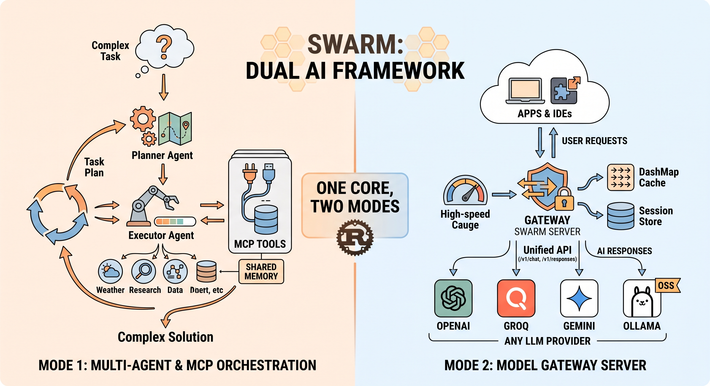

# 🚀 Swarm: Intelligent Multi-Agent Framework & Model Gateway in Rust 🦀


[](https://www.rust-lang.org)
[](LICENSE)
[](https://modelcontextprotocol.io)

> **Swarm** is a high-performance Rust framework designed to build, coordinate, and orchestrate intelligent AI agents. It operates in **two distinct modes**:
>
> 1. **🤖 Multi-Agent Orchestration & Tool Execution Mode**: Orchestrates collaborative agent networks (Planner, Executor, Domain Agents) with real-time MCP tools, service discovery, shared memory, and optional LLM-as-a-Judge evaluation.
> 2. **🌐 Model Gateway Server Mode**: Serves as a unified high-performance gateway supporting standard OpenAI-compatible `/v1/chat/completions` (for IDEs and extensions) and stateful multi-turn `/v1/responses` (Open Responses standard).

---

## 🧭 Swarm at a Glance: Two Operating Modes

<p align="center">
  
  <br />
  <em>Figure: Overview of Swarm's dual operating modes — Multi-Agent Orchestration &amp; Model Gateway Server.</em>
</p>

```
+--------------------------------------------------------------------------------------------------+
|                                        SWARM MODES                                               |
+--------------------------------------------------------------------------------------------------+
|                                                                                                  |
|   MODE 1: MULTI-AGENT & MCP ORCHESTRATION               MODE 2: MODEL GATEWAY SERVER             |
|   (kickstart/multi_agent_orchestration_kickstart/)      (kickstart/gateway_kickstart/)           |
|                                                                                                  |
|   • Planner Agent (Dynamic plan generation)             • POST /v1/chat/completions (OpenAI)     |
|   • Executor Agent (Workflow DAG execution)             • POST /v1/responses (Open Responses)   |
|   • Domain Specialists with MCP Tool integration        • Stateful multi-turn turn chaining      |
|   • Discovery (4000) & Memory (5000) services           • Multi-provider (Groq, Gemini, OpenAI,  |
|   • Evaluation & Judge Service (Port 7000)                Ollama / vLLM / local endpoints)       |
|   • Resilient OAuth2 / JWT authentication               • High-throughput lock-free cache        |
|                                                                                                  |
+--------------------------------------------------------------------------------------------------+
```

---

## 📦 Prerequisites

1. **Install Rust**: [rust-lang.org](https://www.rust-lang.org/tools/install) (1.80+ recommended).
2. **Configure Environment Variables**:
   Copy `.env.example` to `.env` and fill in your preferred provider key:
   ```bash
   cp .env.example .env
   ```
   Or export directly in your shell:
   ```bash
   # Groq (default cloud provider for fast inference):
   export GROQ_API_KEY="gsk_your_groq_api_key_here"

   # Google Gemini (optional):
   export GEMINI_API_KEY="your_gemini_api_key_here"

   # OpenAI (optional):
   export OPENAI_API_KEY="your_openai_api_key_here"

   # Local Ollama (optional, e.g. http://localhost:11434/v1/chat/completions):
   # export SWARM_LLM_URL="http://localhost:11434/v1/chat/completions"
   ```

---

## 🤖 Mode 1: Multi-Agent & MCP Orchestration

In this mode, Swarm coordinates specialized agents that dynamically collaborate to solve user requests using live tools:

- **Planner Agent (Port 8280)**: Analyzes the user request and dynamically constructs an execution workflow.
- **Executor Agent (Port 9580)**: Executes each step in the workflow graph with dependency resolution.
- **Domain Agent (Port 8180)**: Specialist agent equipped with the **MCP Runtime** to execute tools (Weather, Customer, Wikipedia search, Scraping).
- **MCP Server (Port 8000)**: Model Context Protocol SSE server providing live tools.
- **Discovery (Port 4000) & Memory (Port 5000)**: Centralized agent registry and conversational context store.
- **Evaluation Service (Port 7000)**: LLM-as-a-Judge self-correction and output verification.

### Quickstart (Mode 1)

```bash
cd swarm

# 1. Launch all agents, MCP server, and infrastructure services:
./kickstart/multi_agent_orchestration_kickstart/01_launch_all.sh

# 2. Run a sample query (e.g., Live Weather via MCP):
./kickstart/multi_agent_orchestration_kickstart/02_test_weather_query.sh "What is the current weather in Boston ?"

# 3. Stop all background processes when done:
./kickstart/multi_agent_orchestration_kickstart/03_terminate_all.sh
```

All configurations for Mode 1 are located in [`kickstart/multi_agent_orchestration_kickstart/config_files/`](kickstart/multi_agent_orchestration_kickstart/config_files).

> [!NOTE]
> **Port Allocation**: In Mode 1, the Basic Domain Agent listens on `Port 8180` (with Planner on `8280`, Executor on `9580`, MCP Server on `8000`). In Mode 2, the Gateway Server listens on `Port 8080`. This clear separation allows both modes to run concurrently on the same machine without port conflicts.

---

## 🌐 Mode 2: Standalone Model Gateway Server

In this mode, `swarm_server` acts as a unified model gateway for client applications, IDEs, and developer tools:

- **OpenAI-Compatible Chat Completions (`POST /v1/chat/completions`)**: Backward-compatible with standard developer tools, IDE extensions, and OpenAI SDKs.
- **Open Responses Standard (`POST /v1/responses`)**: Modern stateful API with multi-turn conversation chaining (`previous_response_id`) and SSE streaming.
- **Dynamic Multi-Provider Routing**: Out-of-the-box routing to **Groq**, **Google Gemini**, **OpenAI**, or **Local Ollama / vLLM / LocalAI**.

### ⚙️ Gateway Configuration Preview

Backend routing and default models are configured in [`kickstart/gateway_kickstart/config_files/gateway_config.toml`](kickstart/gateway_kickstart/config_files/gateway_config.toml):

```toml
[server]
bind_address = "0.0.0.0:8080"
log_level = "info"

[models]
default_model = "openai/gpt-oss-20b"

[providers.groq]
api_url = "https://api.groq.com/openai/v1/chat/completions"

[providers.google]
api_url = "https://generativelanguage.googleapis.com/v1beta/models"

[providers.openai]
api_url = "https://api.openai.com/v1/chat/completions"

[providers.custom]
# Local inference (Ollama / vLLM / llama.cpp / LocalAI)
api_url = "http://localhost:11434/v1/chat/completions"
recommended_models = ["llama3.2:latest", "mistral:latest", "deepseek-r1:8b"]
```

### Quickstart (Mode 2)

```bash
cd swarm

# 1. Launch the standalone Gateway Server (port 8080):
# (Automatically detects .env, active Ollama, or offers an interactive provider menu)
./kickstart/gateway_kickstart/01_launch_gateway.sh

# 2. Test OpenAI-Compatible Chat Completions:
curl -X POST http://localhost:8080/v1/chat/completions \
  -H "Content-Type: application/json" \
  -d '{
    "model": "openai/gpt-oss-20b",
    "messages": [
      {"role": "system", "content": "You are a helpful assistant."},
      {"role": "user", "content": "Explain Swarm architecture in 2 sentences."}
    ]
  }'

# 3. Test Stateful Open Responses (Multi-Turn chaining):
curl -X POST http://localhost:8080/v1/responses \
  -H "Content-Type: application/json" \
  -d '{
    "model": "openai/gpt-oss-20b",
    "input": "My favorite city is Boston."
  }'

# 4. Stop the Gateway Server:
./kickstart/gateway_kickstart/04_terminate_gateway.sh
```

All configurations for Mode 2 are located in [`kickstart/gateway_kickstart/config_files/`](kickstart/gateway_kickstart/config_files).

---

## ⚡ Why Rust? High Performance by Design

Unlike Python-based frameworks (LangChain, LiteLLM), Swarm delivers:

* **⚡ Sub-Millisecond Proxy Latency**: Near-zero proxy overhead powered by Tokio async I/O and Hyper.
* **🔒 Lock-Free Session Management**: High-throughput concurrent state caching with DashMap and Arc-based session stores.
* **🪶 Minimal Resource Footprint**: Lean memory consumption (<25MB baseline) with zero garbage-collection pauses.
* **🛡️ Type-Safe Tool & Protocol Guarantees**: Strict compile-time validation for MCP and A2A payloads, eliminating runtime schema panics.

---

## 📁 Directory Structure

```
swarm/
├── kickstart/
│   ├── multi_agent_orchestration_kickstart/   # Mode 1: Multi-Agent & MCP Launch Suite
│   │   ├── 01_launch_all.sh
│   │   ├── 02_test_weather_query.sh
│   │   ├── 03_terminate_all.sh
│   │   ├── README.md
│   │   └── config_files/                      # Agent & MCP configurations
│   │
│   └── gateway_kickstart/                     # Mode 2: Standalone Gateway Launch Suite
│       ├── 01_launch_gateway.sh
│       ├── 02_test_chat_completions.sh
│       ├── 03_test_open_responses.sh
│       ├── 04_terminate_gateway.sh
│       ├── README.md
│       └── config_files/                      # Gateway server configuration & payload templates
│
├── basic_agent/                               # Specialist domain agent embedding MCP runtime
├── planner_agent/                             # Workflow planner and orchestrator
├── executor_agent/                            # Workflow graph executor
├── agent_factory/                             # Dynamic agent instantiation runtime
└── examples/                                  # Example MCP servers and standalone runners
```

---

## 💡 Core Architecture

* **`swarm_commons`**: Shared core traits, A2A interaction protocols, multi-provider LLM adapters, and lock-free state stores.
* **`swarm_services`**: Microservices providing Agent Discovery (4000), Shared Memory (5000), and LLM-as-a-Judge Evaluation (7000).
* **`swarm`**: Core orchestration engines, specialist agents, and the unified gateway server.

---

## 🗺️ Roadmap & Contributing

- [x] Multi-Agent dynamic workflow planning and execution.
- [x] Model Context Protocol (MCP) tool integration.
- [x] Open Responses (`/v1/responses`) stateful turn chaining.
- [x] OpenAI-compatible (`/v1/chat/completions`) endpoint.
- [x] Multi-provider routing (Google Gemini, Groq, OpenAI, Ollama / vLLM).
- [x] Resilient OAuth2 / JWT agent authentication and auto-discovery retries.

We welcome contributions! Feel free to open issues or pull requests.

---

## ⭐ Show Your Support

If you find Swarm useful, please consider starring our repository! Your support helps us grow.

---

## 🙏 Special Thanks

We rely on the fantastic work of these actively developed crates:

* **MCP Protocol:** [https://github.com/modelcontextprotocol/rust-sdk](https://github.com/modelcontextprotocol/rust-sdk)
* **A2A Protocol:** [https://github.com/EmilLindfors/a2a-rs](https://github.com/EmilLindfors/a2a-rs)
